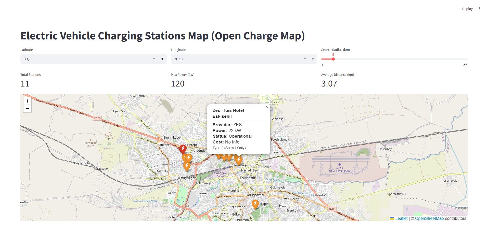

# EV Charging Station Map

A Streamlit web application for visualizing electric vehicle charging stations using the Open Charge Map API. The application displays charging stations on an interactive map with detailed information about each station including power output, connector types, pricing, and operational status.

## Features

- Interactive map visualization using Folium
- Location-based search with adjustable radius (1-50 km)
- Color-coded station markers based on charging speed:
  - 🔴 Red: Fast charging (DC, ≥50kW)
  - 🟠 Orange: Medium speed (AC, ≥22kW)
  - 🟢 Green: Standard/slow charging
- Summary metrics showing total stations, maximum power, and average distance
- Detailed station information in expandable table format
- Data includes: station name, provider, connector types, power output, status, pricing, and distance

Screenhots:





## Requirements

- Python 3.8+
- Open Charge Map API key (free registration at openchargemap.org)

## Installation

1. Install required packages:
``````bash
pip install streamlit requests pandas folium streamlit-folium python-dotenv
``````

2. Create a ``.env`` file in the project directory:
``````
API_KEY=your_open_charge_map_api_key
``````

3. Run the application:
``````bash
streamlit run Home.py
``````

## Usage

1. Enter latitude and longitude coordinates in the input fields (default: Eskişehir, Turkey)
2. Adjust the search radius using the slider (1-50 km)
3. View stations on the map - click markers for detailed information
4. Check summary metrics at the top of the page
5. Expand the data table at the bottom for complete station details

## API Information

The application uses the Open Charge Map API v3 endpoint:
- Endpoint: ``https://api.openchargemap.io/v3/poi/``
- Authentication: API key required
- Data returned: Station locations, operator info, connection types, power ratings, status, and pricing

## Data Fields

Each station displays:
- Name and location coordinates
- Distance from search center
- Operator/provider name
- Available connector types (Type 2, CCS, CHAdeMO, etc.)
- Maximum power output (kW)
- Operational status
- Pricing information (if available)

## Technical Details

- Map implementation: Folium with OpenStreetMap tiles
- Data processing: Pandas DataFrame
- API communication: Requests library
- Environment management: python-dotenv for secure API key storage